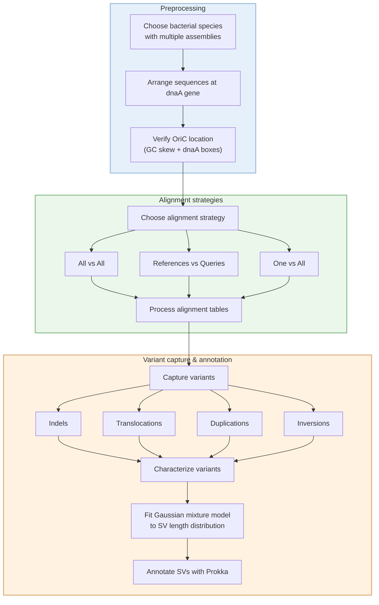

# SVMC 

[](LICENSE)

**SVMC** (Structural Variant Mapping and Characterization) is an R package for analyzing bacterial structural variation.  
It provides tools to locate origins of replication, align complete assemblies, parse alignments for structural variants (SVs), model SV length distributions, and annotate breakpoint contexts. 


---

## 🔧 Installation

```r
##(This package is still in development)
# install.packages("devtools")
devtools::install_github("mdiorio371/SVMC")

library(SVMC)


ncbi_table <- readRDS("ncbi_table.rds")
species_name <- "Salmonella_enterica"

# Run the SVMC workflow
SVMC(
  species    = species_name,
  ncbi_table = ncbi_table
)

```  





### The Origin of replication can be located for an individual or set of complete genome sequences
A confidence score is provided based on the three methods for locating the OriC: the GC inflection, DnaA box clusters, and the dnaA gene annotation.

assembly_dir <- "path/to/assembly"

# Load and analyze assemblies
load_assemblies(species_name, assembly_dir, n = 20)
locate_ori(assembly_dir)


### Alignment strategies summary
%% Alignment strategies schematic

```mermaid
flowchart LR

subgraph One-vs-All
    R1["Reference"]
    Q1["Query 1"]
    Q2["Query 2"]
    Q3["Query 3"]
    Q4["Query 4"]
    Qn["..."]

    R1 --> Q1
    R1 --> Q2
    R1 --> Q3
    R1 --> Q4
    R1 --> Qn
end

subgraph Refs-vs-Queries
    R2a["Ref 1"]
    R2b["Ref 2"]
    R2c["Ref 3"]
    R2n["..."]

    Q2a["Query 1"]
    Q2b["Query 2"]
    Q2c["Query 3"]
    Q2n["..."]

    R2a --> Q2a
    R2a --> Q2b
    R2a --> Q2c
    R2a --> Q2n

    R2b --> Q2a
    R2b --> Q2b
    R2b --> Q2c
    R2b --> Q2n

    R2c --> Q2a
    R2c --> Q2b
    R2c --> Q2c
    R2c --> Q2n

    R2n --> Q2a
    R2n --> Q2b
    R2n --> Q2c
    R2n --> Q2n
end

subgraph All-vs-All
    A["Genome 1"]
    B["Genome 2"]
    C["Genome 3"]
    D["Genome 4"]
    E["Genome 5"]
    N["..."]

    A <--> B
    A <--> C
    A <--> D
    A <--> E
    A <--> N

    B <--> C
    B <--> D
    B <--> E
    B <--> N

    C <--> D
    C <--> E
    C <--> N

    D <--> E
    D <--> N

    E <--> N
end
