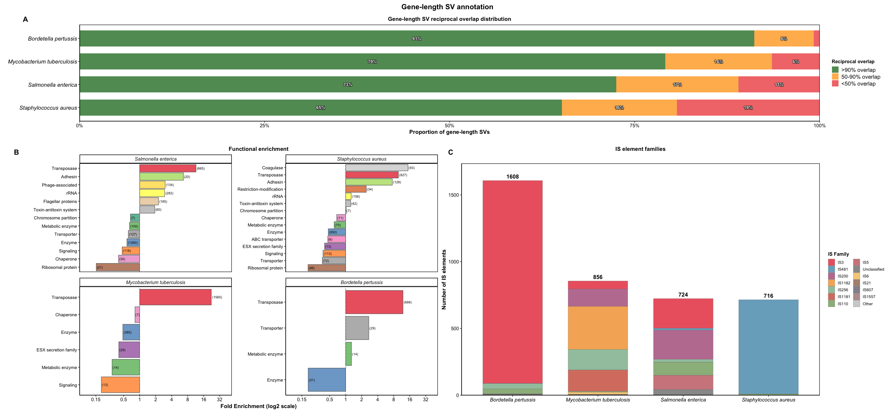

[](LICENSE)

### SVMC 


**SVMC** (Structural Variant Mapping and Characterization) is an R package for analyzing bacterial structural variation.  
It provides tools to locate origins of replication, align complete assemblies, parse alignments for structural variants (SVs), model SV length distributions, and functionally annotate gene length SVs and genic disruption. 


---

## 🔧 Installation

```r
# install.packages("devtools")
devtools::install_github("mdiorio371/SVMC")

library(SVMC)


ncbi_table <- readRDS("ncbi_table.rds")
species_name <- "Salmonella_enterica"

# Run the SVMC workflow
SVMC(
  species    = species_name,
  ncbi_table = ncbi_table
)

```  


### The Origin of replication can be located for an individual or a set of complete genome sequences
A confidence score is provided based on the three methods for locating the OriC: the GC inflection, DnaA box clusters, and the dnaA gene annotation.

assembly_dir <- "path/to/assembly"

# Load species assemblies and locate markers for the origin of replication
load_assemblies(species_name, assembly_dir, n = 20)
locate_ori(assembly_dir)


Origin of replication signal profiles across bacterial species. Plots show GC disparity (black lines) and dnaA box cluster density (blue points), and the location of the dnaA gene (vertical arrow) along individual complete genomes. Vertical shaded lines indicate predicted origin positions by a combined score of the three metrics. The OriC positions of the top three scores are shown for each species. 


### Annotation of gene-length SVs and enrichment analyses



Annotations of gene-length SVs. (A) Distribution of reciprocal overlap thresholds for gene-length SVs across four bacterial species.(B) Functional enrichment of gene categories disrupted by gene-length SVs, shown as log₂ fold enrichment relative to genomic background within each sequence. (C) Abundance and family composition of insertion sequence (IS) elements.
