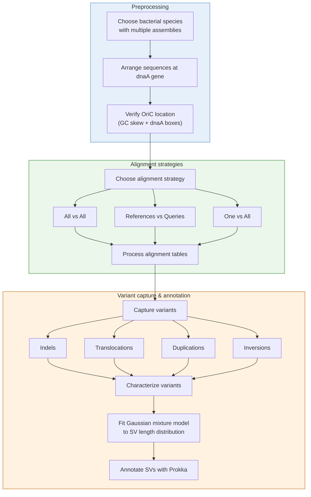
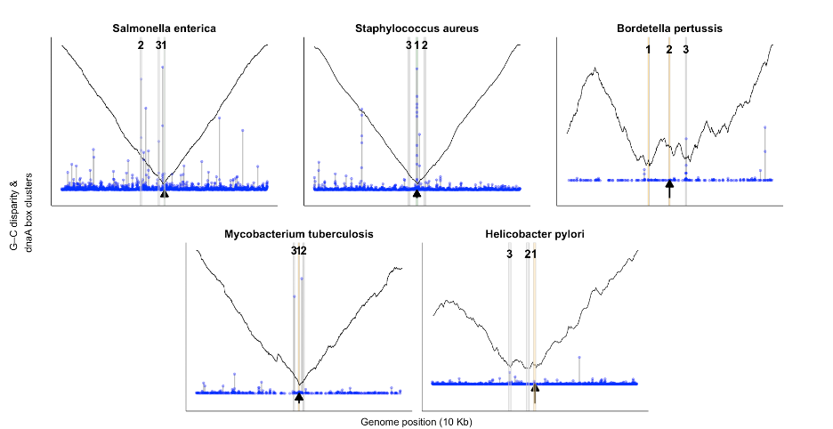

# SVMC 
Structural variant mapping and characterization

(This R Package is under development)

install.packages("devtools")
devtools::install_github("mdiorio371/SVMC")

library(SVMC)

ncbi_table <- readRDS("ncbi_table.rds")
species_name <- "Salmonella_enterica"

SVMC(
  species = Salmonella_enterica, 
  ncbi_table = ncbi_table
  )

### The Origin of replication can be located for an individual or set of complete genome sequences
A confidence score is provided based on the three methods for locating the OriC: the GC inflection, DnaA box clusters, and the dnaA gene annotation.

assembly_dir <- "path/to/assembly"

load_assemblies(species_name, assembly_dir, n = 20)

locate_ori(assembly_dir)

